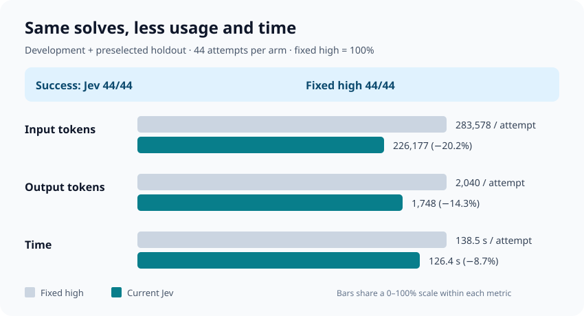

# 评测

[English](README.md) | 简体中文 | [日本語](README_JA.md)

由分类器路由的推理强度，能否在保持解决率的同时，比固定强度花费更少的推理？这些报告在来自
[SWE-bench Verified](https://huggingface.co/datasets/SWE-bench/SWE-bench_Verified)
的真实编码任务上对此进行了测量。每次尝试都会在全新的检出副本中运行一个编码智能体，然后用官方 SWE-bench
测试框架对结果评分。

## 核心结果

在所测试的 GPT-6 Astra 任务组合上，Jev 路由的推理强度与固定 `high` 强度各自解决了
**44/44 次尝试**。每次尝试中，Jev 少用了 **20% 的输入 token**、**14% 的输出 token**（含推理），
并节省了 **9% 的时间**。

这只是一个模型、一个分类器和一个较小的任务集。它不是对一般工作负载的估计，也不能证明解决率相同。引用这些数字之前，
请先阅读[汇总报告](results/router-consolidated-2026-09-25.md)。

## 报告

| 报告 | 涵盖内容 | 结论 |
| --- | --- | --- |
| [Astra 汇总评测](results/router-consolidated-2026-09-25.md) | 合并所有 Jev 与 `high` 的对比组 | 即上文的核心结果。**请从这里开始。** |
| [配额受限的自动研究](results/quota-autoresearch-2026-09-24.md) | 6 个预先选定的任务，每组 6 次尝试，外加一项候选提示词改动 | Jev 与 `high` 均解决 36/36，Jev 少用 16% 的输出 token。候选提示词未被采纳。 |
| [pytest #5787](results/astra-pytest-5787.md) | 一个高难度任务，在 `medium`、`high`、`xhigh` 和 Jev 下每组 5 次尝试 | Jev 解决 5/5，而 `medium` 为 1/5。探索性结果：该任务是在发现差距之后才选定的。 |
| [pytest #5787，无回退](results/astra-strict-2026-09-24.md) | 同一任务，禁用分类器回退 | Jev 解决 5/5 且无任何回退，成本与 `high` 相近。 |
| [强度边界搜索](results/astra-boundary-2026-09-24.md) | 搜索 5 个候选任务，寻找 `medium` 与更高强度之间的差距 | 未发现可靠的边界。表明在这些运行中 Jev 从未选择 `xhigh`。 |
| [试点](results/pilot.md) | 在 Astra 和 Sol 上首次运行的 2 个任务 | 早期的合理性检查，不是基准测试。 |

## 如何解读结果

- **对比组（arms）：** 每个任务分别在固定强度（如 `medium` 和 `high`）下运行，以及在由分类器路由的强度下运行（标记为 `jev`）。
  模型、提示词、基础提交、超时和评分器在各组之间保持不变。
- **Solved（已解决）** 来自 SWE-bench 评分器。**Evidence valid（证据有效）** 表示该次尝试的 token 用量被完整记录。
  token 均值只使用证据有效的尝试，因此比较之前请检查分母。
- **输出 token** 包含推理。缓存的输入属于输入的一部分，不是额外的类别。token 和时间是消耗量的度量，不是美元成本。
- 只发布元数据。提示词、补丁、轨迹和评分器日志保留在测试框架被忽略的 `eval/runs/` 目录中。

## 来源

所有运行都在 2026-09-23 至 2026-09-25 期间使用 Jev 进行，早于路由器迁入本仓库，因此报告中的提交哈希和脚本路径早于此次迁移。
Jev 请求、它接收到的对话状态，以及所选强度如何应用到模型请求上，在 `reasoning-router` 中均保持不变。

## 复现

评测框架尚未加入本仓库，因此无法在此处重新运行这些结果。
